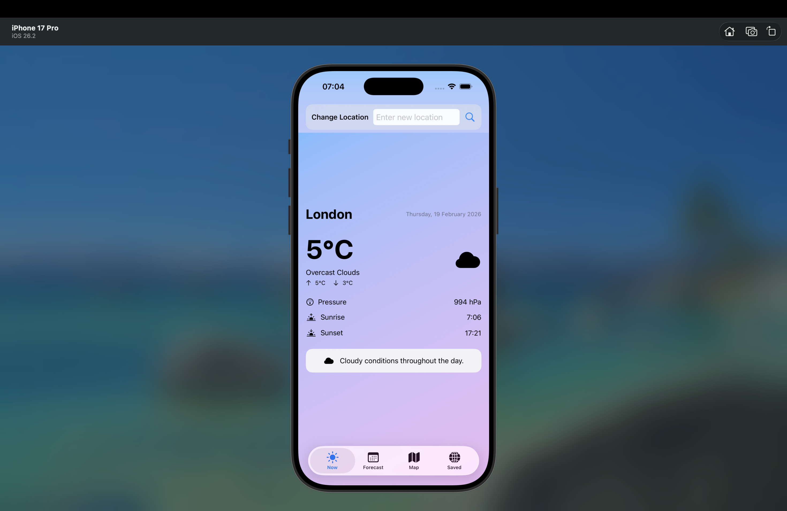
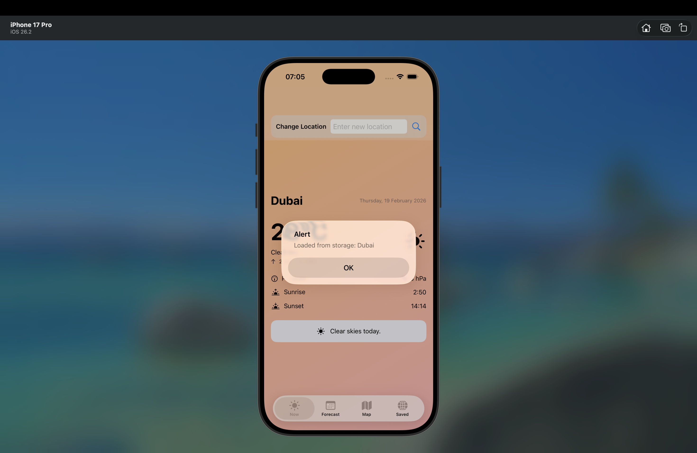
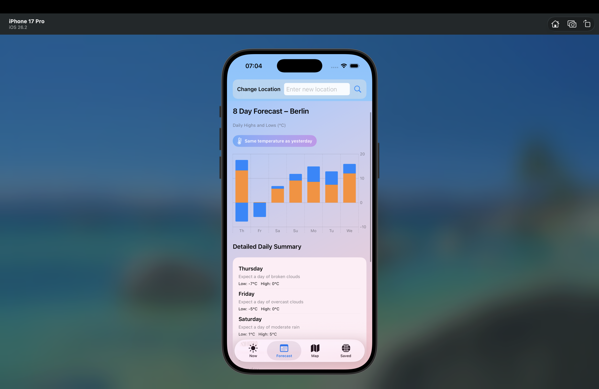
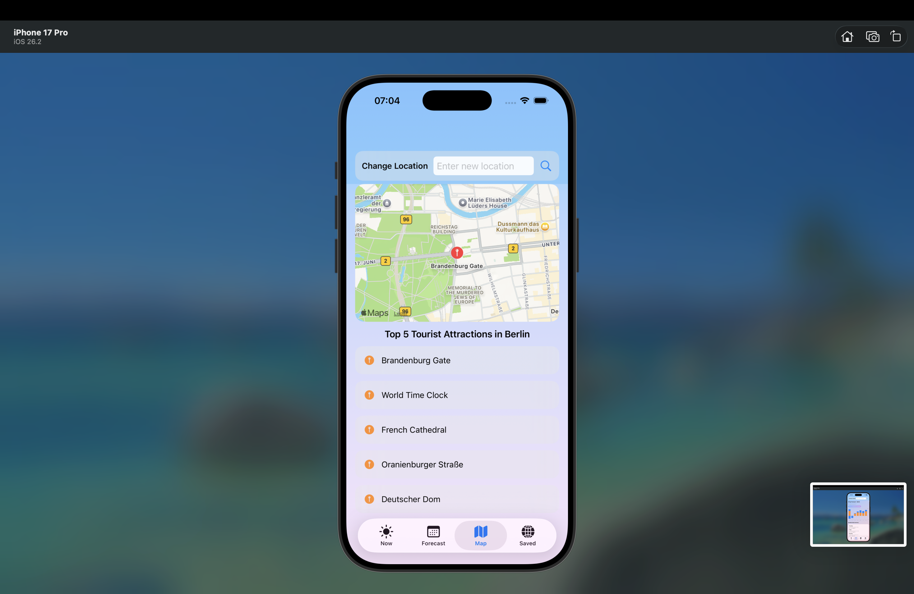
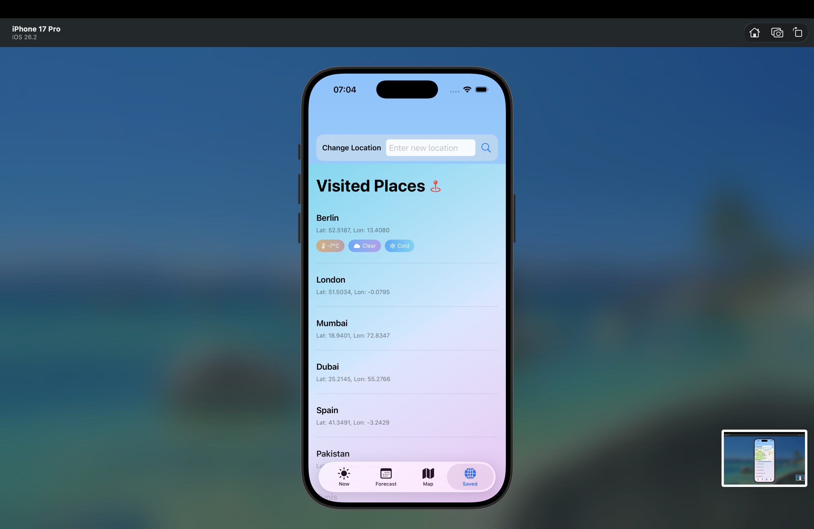
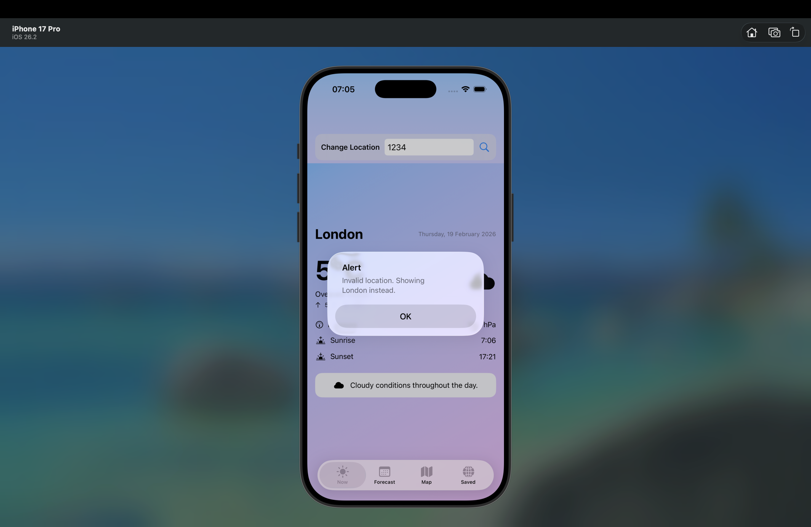

iOS Weather Dashboard (SwiftUI)
================================

A native iOS weather dashboard built using SwiftUI and MVVM architecture.
The application integrates the OpenWeather API to provide real-time weather data, multi-day forecasts, map-based tourist points of interest, and persistent saved locations.

Overview
--------

The app allows users to:

- Search for any city worldwide
- View real-time current weather data
- View an 8-day forecast with temperature chart
- Explore top tourist attractions on an interactive map
- Save and revisit previously searched locations
- Experience dynamic UI theming based on temperature

Dynamic UI Behaviour
--------------------

The application includes state-driven UI logic:

- Cold temperatures → Blue gradient background
- Mild temperatures → Purple gradient background
- Hot temperatures → Orange/Red gradient background

Map Interaction
---------------

- Displays top 5 tourist attractions near the selected city
- Tapping an annotation zooms into the location
- Long-pressing an annotation opens the location in Google Search
- Integrates MapKit and CoreLocation for geocoding and search

Architecture
------------

The project follows the MVVM pattern.

Model
- Weather API response models (Codable)
- Persistent Place and AnnotationModel using SwiftData

ViewModel
- Business logic
- Networking layer
- Async/Await API integration
- Error handling
- State management

View
- SwiftUI UI
- Chart rendering
- Dynamic gradients
- Map annotations
- Alerts and interaction handling

Utility
- Date formatting helpers
- Weather condition mapping
- Custom error types

Tech Stack
----------

- Swift
- SwiftUI
- MVVM
- Async/Await
- MapKit
- CoreLocation
- SwiftData
- Codable
- OpenWeather API

Screenshots
-----------

Current Weather (London)

Current Weather (Dubai – Dynamic Theme)

8-Day Forecast

Map View – Tourist Attractions

Saved / Visited Places

Error Handling

Setup
-----

1. Clone the repository  
2. Add your OpenWeather API key in Secrets.swift  
3. Build and run in Xcode  

Notes
-----

Secrets.swift is excluded from version control via .gitignore.
This repository is public for portfolio and recruiter review.
